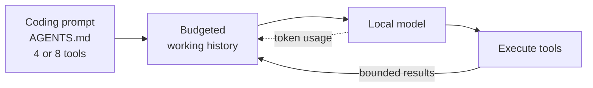
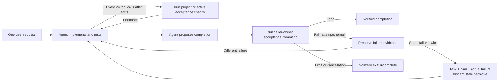
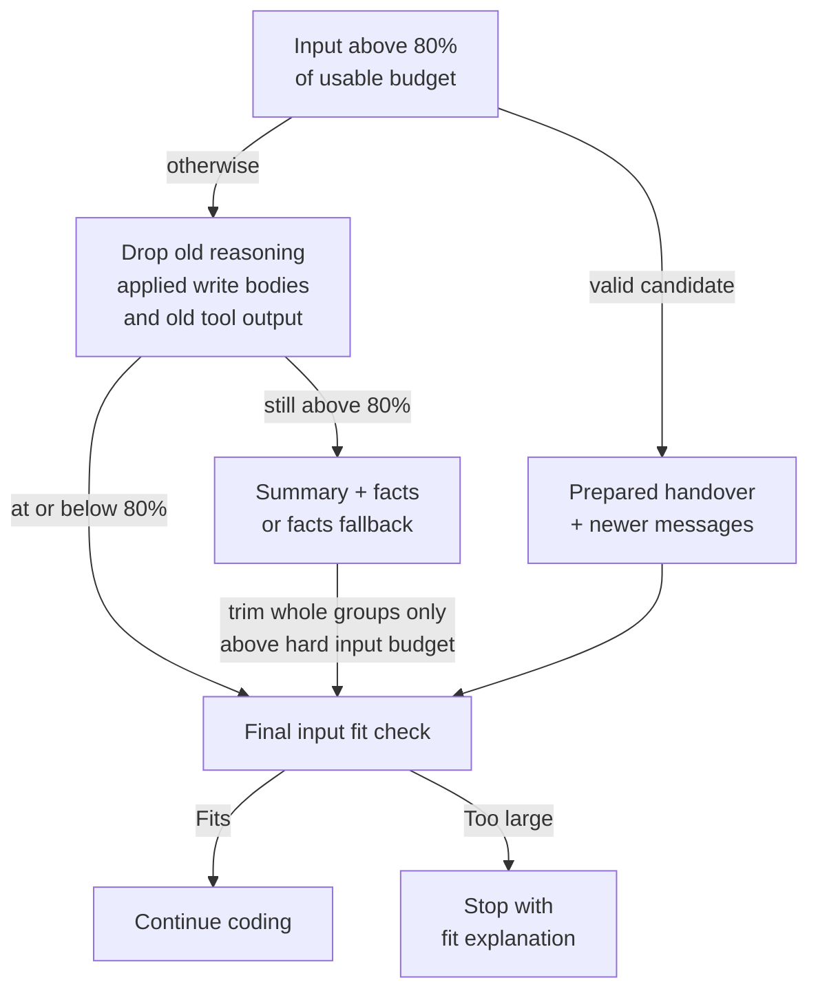
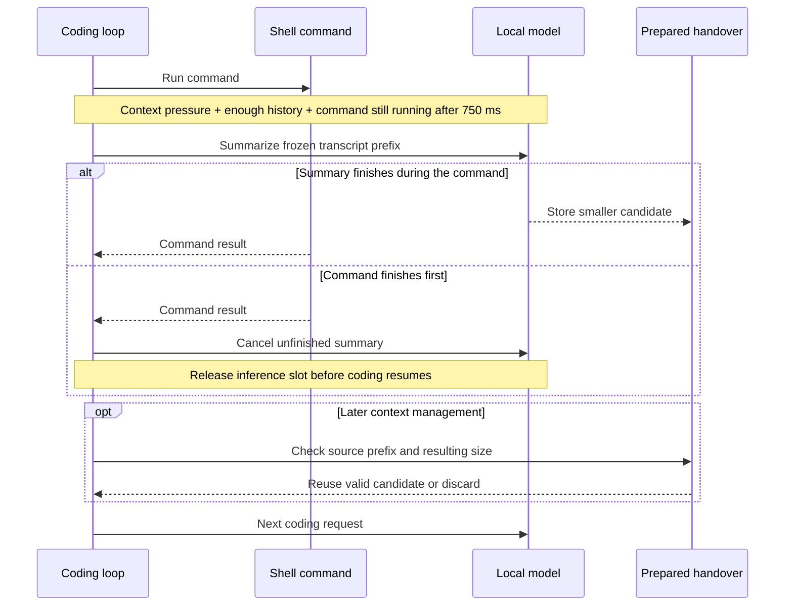
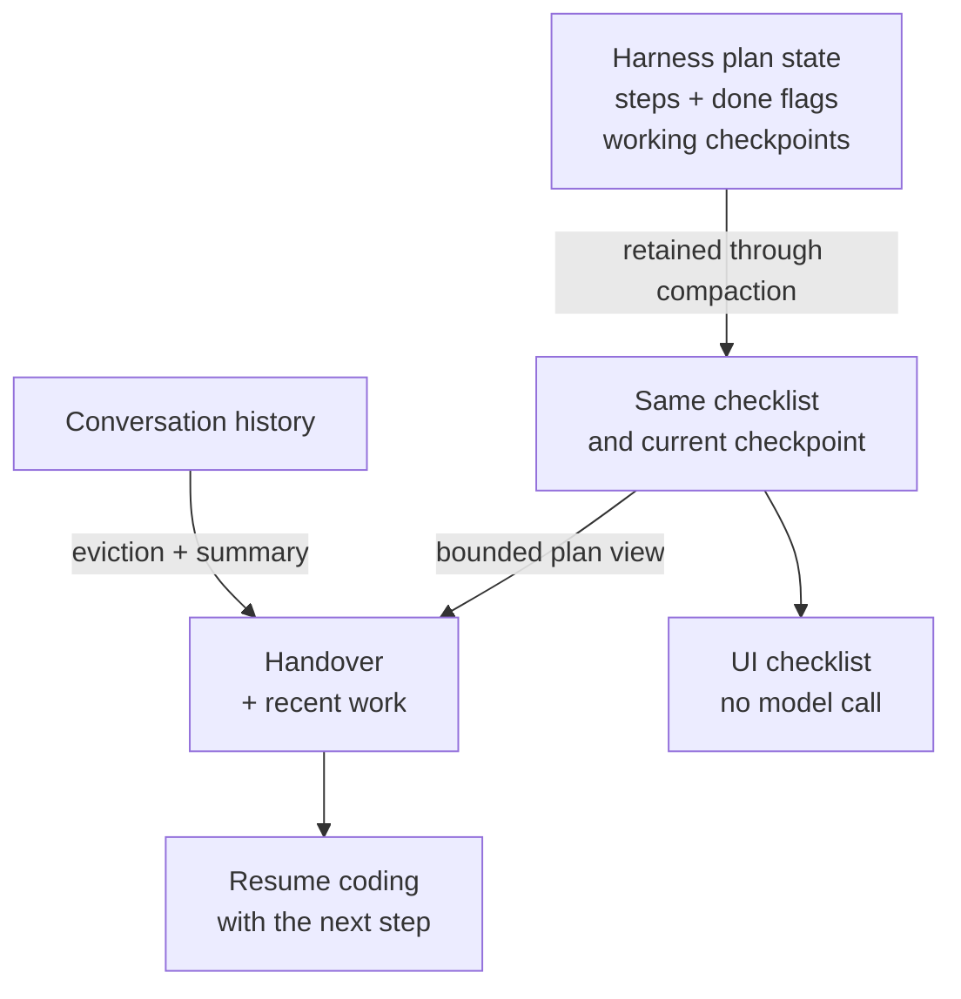

# How smolcoder works

The mechanics behind smolcoder, kept out of the README so the setup guide stays short: how each request is built, how the context window is budgeted and compacted, how the plan survives compaction, what runs to check a change, and how this compares with other harnesses. None of it is needed to use smolcoder.

## Built around the next coding step

Each coding request contains a short system prompt, project instructions from `AGENTS.md` when present, the tools allowed by the current mode, and a budgeted working history. Tool selection is deliberately simple: eight tools in edit/bypass mode, four in read-only mode. Tool schemas use flat parameters and example calls; file reads and command results have bounded output.



The harness handles bookkeeping, output limits and recovery in code. The model concentrates on choosing the next action and writing the change. This is the design advantage for constrained models; it is not a measured speed or quality advantage over every other harness. See [context management](#context-management), [planning](#planning-that-survives-compaction), and [the comparison](#how-this-compares).

## Checks and acceptance

After file edits, the shared agent loop automatically runs available Node project scripts named `build`, `test`, and `test:e2e` before completing. During longer implementations it also runs these checks after each 24 tool calls, so cycles of reading and adjusting interfaces encounter actual compiler/test feedback. This works in the terminal, web UI, and headless mode. An unrelated follow-up question does not rerun checks. Project scripts only establish what they actually test; a zero exit code does not certify every requested behavior.

`--verify` supplies a caller-owned final acceptance command. The host keeps the command; the model receives its failure evidence. Project checks run during longer implementations without consuming final acceptance attempts. Before final acceptance begins, recovery from repeated tools also uses a known failing project check. After acceptance fails, periodic checks use that same acceptance command and count toward its limit. Before completing, the harness runs the acceptance command in the workspace, feeds actual failures back to the same agent, and continues repairs automatically. It also uses acceptance feedback to recover from repeated tool attempts or sustained reading after edits. Bounded excerpts of actual failures survive compaction. Six acceptance attempts by default and the overall model-step budget bound the work; exhaustion or cancellation exits nonzero. Use `--verify-attempts 12` when a complex task needs a larger repair budget. This changes the allowed number of checks; the acceptance command must still pass. Each check has the normal 120-second command deadline. This option currently applies to headless runs. Supply behavioral checks: a production build alone cannot establish that a game's Play button, movement, or saving works.



In a fresh conversation, two consecutive equivalent acceptance failures trigger facts-only compaction even if the context window has space. It retains the request, plan/checkpoint, touched files and actual failure, and discards old model-written narratives before continuing. This gives a repeated wrong assumption less room to perpetuate itself. Repeat detection ignores numbers and whitespace; the model still receives the original output. A changed failure keeps the working context, and this recovery never raises the attempt limit or adds a summarization request. Sessions with earlier user turns retain ordinary compaction so this reset cannot discard prior user decisions stored in summaries.

## Context management

The budget follows the context allocated by the local server when that information is available. A model advertised as supporting a large window may be loaded with a much smaller one. A smaller allocation detected at the start of a turn or after its first response reduces smolcoder's budget automatically.

Before sending a coding request, smolcoder reserves space for its reply and a safety margin:

```text
reply reserve = clamp(floor(window / 4), 128, 8192) tokens
safety margin = min(256, floor(window * 0.05)) tokens
usable input  = window - reply reserve - safety margin
```

| Loaded window | Reply reserve | Safety margin | Usable input |
|---|---:|---:|---:|
| 4,096 tokens | 1,024 | 204 | 2,868 |
| 16,384 tokens | 4,096 | 256 | 12,032 |

The input budget includes instructions, tool schemas, requests and history. Backend token counts anchor the estimate after each response; newly added text is estimated conservatively, with calibration from observed usage. The meter is an estimate between responses, not an exact tokenizer. Reasoning history is counted according to what each provider actually replays.

### Compaction in stages

Large obsolete file reads are replaced with stubs after a successful edit or write. Before a subsequent model request, context management normally starts above **80% of the usable input budget**. A completed, valid background handover can be reused immediately; otherwise older reasoning, completed write payloads and old tool output are removed before asking the model to summarize. Completed writes become marked harness history records, with no placeholder code in executable tool arguments or fabricated assistant answers. The newest tool group is protected. If the remaining content cannot shrink further, repeated futile summaries are suppressed while the final fit check stays active.



Eviction aims for 60% to create headroom. The handover combines **harness-recorded facts** with a short **model-written narrative**:

- The original and current requests are retained. The system prompt and loaded `AGENTS.md` remain in place.
- The plan comes first in a bounded facts section, followed by touched files and recent command outcomes. These facts are assembled from state rather than reconstructed by the summarizer.
- The model receives a sized digest and previous handover, with three headings: **In progress**, **Next** and **Notes**. It is asked to preserve exact APIs and unresolved errors without repeating the goal and checklist. Reasoning is off, tools are absent, output is capped at 700 tokens and the deadline is 45 seconds. The returned narrative also has a context-sized character cap.
- Very small budgets skip model summarization. A failed foreground summary falls back to recorded facts and the previous narrative. Recent assistant/tool groups stay paired; whole groups are removed only when necessary to fit the hard input budget. Crossing the 80% soft target alone does not erase the source just read.

File reads return contiguous, context-sized pages with an accurate continuation line. Recent command records retain exit outcomes rather than entire inline scripts. The repeated-read guard counts evidence still present in the model's context: refetching data removed by compaction is allowed. Repeated retained observations trigger coaching, then acceptance feedback when configured or a recoverable stop. Model-written summaries and checkpoints remain advisory; current files and tool results take precedence.

Failed edits return a bounded source range and continuation arguments. Bash pipelines preserve upstream failure codes, and long command logs retain both their beginning and final error details. These checks keep verification failures visible to the model.

`/compact` forces compaction even below the automatic threshold. A window that cannot hold the remaining instructions and requests produces an actionable error. Summaries are lossy, and the facts section is bounded: keep steps concise, retain project conventions in `AGENTS.md`, and re-read source files when exact code matters.

### Background compaction on the same local model

At **60% of usable input**, a sufficiently long history can be snapshotted while `run_command` is running. The same local model prepares a handover during that wait. This overlaps shell work with inference; coding and maintenance inference share a single slot per server URL within the smolcoder process.



The snapshot excludes the unresolved tool batch. Reuse requires an unchanged source prefix, a smaller result and a combined prompt within the 80% target; messages appended since the snapshot are kept. A new turn, changed configuration or transcript changes can invalidate the candidate. Optional summaries and session titles yield to foreground inference, and are deferred when the server is busy. Separate processes and external clients have separate scheduling, so this is not a machine-wide GPU lock.

This can hide summary latency behind a long command without requiring a second model. Short commands may leave no time to finish, and summarization still consumes compute and can disturb the backend's prompt cache. The synchronous path remains available.

## Planning that survives compaction

Multi-step work uses a checklist owned by the harness. It contains up to 20 steps, each with text, a completion flag and an optional working checkpoint. The harness derives the current step as the first unfinished one. Compaction can replace the conversation while this state remains intact. The prompt asks for runnable increments: wire an entry point and verify it before expanding the application.



The model creates a plan with one newline-separated string. A single-line semicolon list is accepted too, so it cannot accidentally become one giant completed step:

```json
{"action":"set","steps":"Inspect the failing test\nImplement the fix\nRun the tests"}
```

To advance, it calls the same `plan` tool with `{"action":"done"}`. The harness marks the current step and returns `Done: 1. Next: 2. Implement the fix`. The model can also finish a numbered step, append a step, or inspect the checklist with `show`.

During an investigation, `{"action":"checkpoint","text":"save.js exports makeSaver(storage, size); next: replace missing imports"}` replaces the current step's notes, up to 1,000 characters. The checkpoint is kept verbatim in plan state and re-injected with the active step, so an exact interface need not be repeatedly reconstructed by the summarizer. Completed-step notes remain in stored state but leave the active prompt. After a long sequence of reads, the agent receives a reminder to record its findings and make a small, verifiable edit.

That small contract is the optimization: no nested step objects, no status vocabulary to regenerate, and no need to rewrite the full plan on every completion. UI rendering adds no inference call; tool arguments, feedback and the model-facing checklist still use tokens. After four non-plan tool calls with unfinished work, a short reminder is attached to the tool result. A premature final answer can receive a bounded continuation nudge.

The complete checklist survives compaction in both interfaces. Web session snapshots also save it for restart/resume; terminal sessions keep it for the running session. Its representation in a handover shares a capped facts budget, so very long step text can be shortened there while the underlying checklist remains available through `plan` / `/plan`.

This is a sequential execution checklist. It does not schedule a dependency graph, delegate work, require a separate planning model, or verify that a checked step is correct. Make verification an explicit step and run the tests.

## How this compares

Planning and compaction are established techniques. smolcoder's distinction is the combination of a small default interface, state-backed progress, measured local context budgets and opportunistic maintenance on the same model. The comparison below describes documented mechanisms, checked on **13 September 2026**; it is not a benchmark ranking.

| Harness | Planning | Context and local-model support |
|---|---|---|
| **smolcoder** | One flat `plan` tool, incremental completion, harness-derived next step and checklist state retained through compaction. | Eight coding tools, or four in read-only mode; loaded-window budgets; staged eviction; same-model background handovers with foreground priority. |
| **Claude Code** | Plan mode for exploring and proposing changes; task tools can track status and dependencies, with availability depending on model/settings. [Architecture](https://code.claude.com/docs/en/how-claude-code-works), [task tools](https://code.claude.com/docs/en/tools-reference#task-tool-availability). | Its documented Claude workflow also clears old tool output before summarizing, and defers MCP tool definitions. These techniques are shared, rather than unique to smolcoder. [Context management](https://code.claude.com/docs/en/how-claude-code-works#the-context-window). |
| **Codex** | A planning mode plus structured plan updates with step statuses. [Commands](https://learn.chatgpt.com/docs/developer-commands?surface=cli), [plan events](https://learn.chatgpt.com/docs/app-server#turn-events). | Automatic compaction has a configurable token threshold. Codex also supports Ollama and LM Studio through `--oss`; local execution alone is not a smolcoder differentiator. [Configuration](https://learn.chatgpt.com/docs/config-file/config-reference). |
| **OpenCode** | Separate Build and Plan agents, plus a `todowrite` tool for tracking multi-step work. [Agents](https://opencode.ai/docs/agents/#built-in), [todos](https://opencode.ai/docs/tools/#todowrite). | Supports local providers, automatic compaction, optional old-output pruning and a configurable compaction reserve. [Providers](https://opencode.ai/docs/providers/#ollama), [compaction settings](https://opencode.ai/docs/config/#compaction). |

For a small local model, smolcoder offers these choices together without configuring a broader agent system. The expected benefit is less prompt and bookkeeping overhead, more deliberate use of a small window, and fewer competing inference requests. The tradeoff is a narrower feature set and a simple sequential plan. Relative speed, code quality and completion rate still need matched tests using the same model, hardware, task and context allocation.

The current validation includes a live Ollama run at a **4,096-token window**: 24 tool calls, eight compactions, all five plan steps completed, and eight generated tests passed and independently rerun. That demonstrates continuity under pressure on a small task; it does not establish superiority over the harnesses above. The [audit record](audit-2026-09-13.md#validation-and-limits) includes the setup and limits, and [the smoke-test prompt](../bench/context-smoke.txt) is repeatable in a disposable project.

A larger trial built a playable Minecraft-inspired voxel sandbox through Ollama, followed by supervised repairs and independent browser checks. Its initial 8k and 16k builds stalled; focused repairs produced the working result. The [full lifecycle record](lifecycle-2026-09-13.md) documents those failures, the resulting harness changes, acceptance tests and fault-injection checks. This is evidence of a recoverable workflow, not unattended complex-build reliability.

The [unattended follow-up](unattended-2026-09-13.md#final-accepted-results) includes accepted fresh voxel-game builds through both Ollama and LM Studio, with no manual game edits or agent restarts within either trial. Both unchanged games passed thirty independent checks across the actual preview and a direct browser, covering Play, movement after turning, visible block edits, saving, New World and invalid-save recovery. Exact source archives, traces and failed trials are retained. These runs used installed 27B Q4 models at 64k context; they demonstrate selected successful builds, not a general completion rate or a competitor ranking.

Implementation: [context manager](../src/context.ts), [plan state](../src/plan.ts), [agent loop](../src/agent.ts), [tool schemas](../src/tools/index.ts), [inference scheduler](../src/providers/scheduler.ts).

## Finding model servers

Detection builds a list of addresses where a server could be, then asks each one what it is. The answer decides the backend, never the port: an address that returns Ollama's model list (`/api/tags`) is Ollama, one that returns LM Studio's catalog (`/api/v1/models`, or the older listings) is LM Studio. Both requests go out together, so an address with nothing behind it costs one timeout.

On this computer the list holds the loopback spellings (`127.0.0.1`, `localhost`, `[::1]`) on port 11434, on `OLLAMA_HOST`, on the port in LM Studio's `http-server-config.json` (found through `~/.lmstudio-home-pointer` when its folder was moved) and on the default 1234. Spellings of one port count as one server, and the first that answers is used. `docker ps` (or `podman ps`) adds host ports that containers publish for either backend. Inside WSL or a container, the default gateway and `host.docker.internal` are added, because loopback there does not reach a server on the host. Every server found is merged into one model list.

Network hosts are the machines added from the model picker, saved in `~/.smolcoder.json`. A bare host is tried on both usual ports; `host:port` or a URL names one server. They are probed alongside the local addresses with a 1.5-second timeout. At startup the search ends as soon as the remembered model turns up, so a machine that is switched off adds no delay. The remembered model is stored with its server address, which keeps the same model id on two machines apart. When nothing is remembered, a model on this computer is preferred over one on the network.

"Search my network" is a TCP connect sweep of the private IPv4 subnets this computer is on, 64 connections at a time with a 350 ms timeout, on the two model-server ports. It needs no ping, raw sockets or admin rights. Subnets are chosen by address (10/8, 172.16/12, 192.168/16), not by adapter name, and a network wider than a /22 is searched only in the /24 around this computer. Open ports are then identified as above. When the network can name a machine and that name resolves back to the same address, the name is saved instead of the IP, so a new DHCP lease does not break it. The sweep runs only when asked for, never at startup and never in headless runs, and a machine it finds is not used until it is picked.

## Local APIs and failure recovery

Ollama uses [native chat](https://docs.ollama.com/api/chat) for tools, thinking, keep-alive and token/timing usage, plus [running-model information](https://docs.ollama.com/api/ps) for loaded context. LM Studio uses its [native model catalog](https://lmstudio.ai/docs/developer/rest/list) and [OpenAI-compatible tool streaming](https://lmstudio.ai/docs/developer/openai-compat/chat-completions). For an unloaded LM Studio model, an explicit `--ctx` uses the [native load API](https://lmstudio.ai/docs/developer/rest/load) and checks the returned allocation. Already-loaded models are not reloaded to enlarge their windows.

Requests have a three-minute silence timeout and a fifteen-minute total deadline. Transient failures retry up to three attempts, with cancellable backoff. Context-overflow recovery gets one forced compaction attempt. Malformed or incomplete streams cannot execute partial tool calls. Repeated empty responses stop with a recoverable error. Repeated failed or unchanged tool calls invoke available acceptance checks for automatic repair, or fail visibly when no check is available. Failed or cancelled headless runs exit unsuccessfully.

If reasoning consumes the entire reply without producing an answer or tool call, the harness announces one response with thinking disabled. Repeated exhaustion in the same turn extends that recovery interval to four, then at most eight responses. It then retries the selected effort; the session preference is never changed. This limits repeated unproductive reasoning while still allowing the model to reason again.

Restored web sessions repair interrupted tool conversations and retire old approval buttons; an interrupted command's outcome must be inspected before retrying. These protections make failures visible and preserve a path to continuation. They cannot guarantee that a local server stays running or that generated code is correct.
